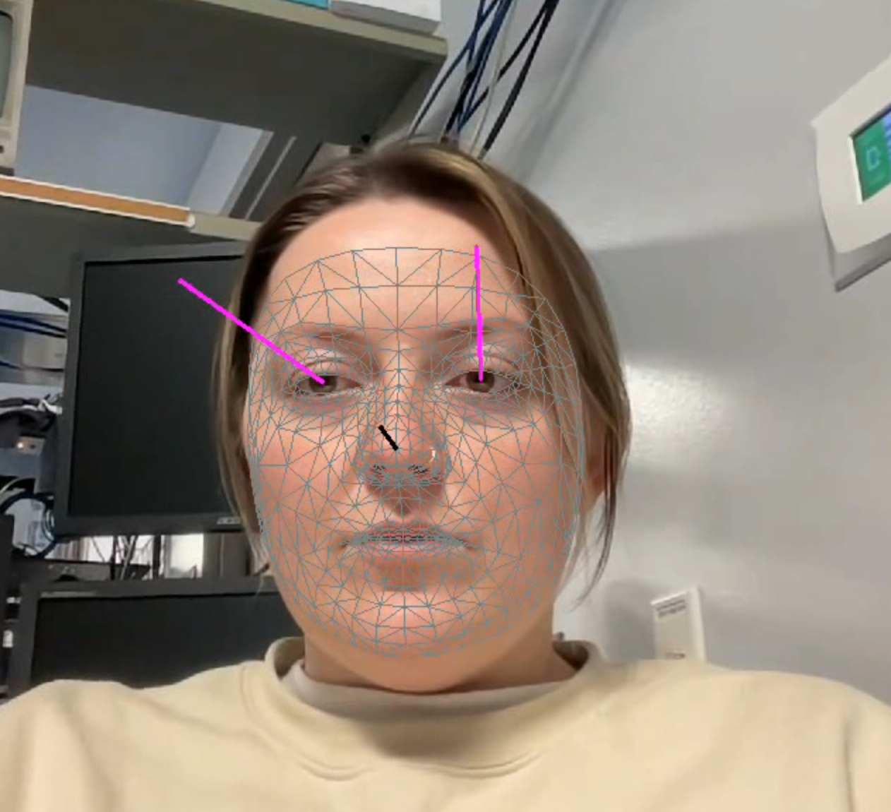

<!-- Improved compatibility of back to top link: See: https://github.com/mayolabvision/video_eyeTracking/pull/73 -->
<a id="readme-top"></a>
<!--
*** Thanks for checking out the video_eyeTracking. If you have a suggestion
*** that would make this better, please fork the repo and create a pull request
*** or simply open an issue with the tag "enhancement".
*** Don't forget to give the project a star!
*** Thanks again! Now go create something AMAZING! :D
-->


<!-- PROJECT SHIELDS -->
<!--
*** I'm using markdown "reference style" links for readability.
*** Reference links are enclosed in brackets [ ] instead of parentheses ( ).
*** See the bottom of this document for the declaration of the reference variables
*** for contributors-url, forks-url, etc. This is an optional, concise syntax you may use.
*** https://www.markdownguide.org/basic-syntax/#reference-style-links
-->
[![Contributors][contributors-shield]][contributors-url]
[![Forks][forks-shield]][forks-url]
[![Stargazers][stars-shield]][stars-url]
[![Issues][issues-shield]][issues-url]
[![LinkedIn][linkedin-shield]][linkedin-url]


<!-- PROJECT LOGO -->
<br />
<div align="center">
  <a href="https://github.com/mayolabvision/video_eyeTracking">
    
  </a>

<h3 align="center">Offline Gaze Tracking from Video: Analyzing Eye Movements and Head Pose</h3>

  <p align="center">
    This project focuses on offline gaze tracking from video data, where the input is a video of a subject’s face. The code processes the video to analyze eye movements and head pose, generating output videos that visually demonstrate each processing step. Additionally, two CSV files are produced: one containing the pixel coordinates of facial landmarks for each frame, and another with the calculated gaze and head pose vectors. In this version, the gaze vectors are in pixel units because the necessary calibration information—such as camera focal length, subject distance, and face width—is not available, preventing the calculation of gaze in degrees of visual angle.
    <br />
    <a href="https://github.com/mayolabvision/video_eyeTracking"><strong>Explore the docs »</strong></a>
    <br />
    <br />
    <a href="https://github.com/mayolabvision/video_eyeTracking">View Demo</a>
    ·
    <a href="https://github.com/mayolabvision/video_eyeTracking/issues/new?labels=bug&template=bug-report---.md">Report Bug</a>
    ·
    <a href="https://github.com/mayolabvision/video_eyeTracking/issues/new?labels=enhancement&template=feature-request---.md">Request Feature</a>
  </p>
</div>

<!-- TABLE OF CONTENTS -->
<details>
  <summary>Table of Contents</summary>
  <ol>
    <li>
      <a href="#about-the-project">About The Project</a>
      <ul>
        <li><a href="#built-with">Built With</a></li>
      </ul>
    </li>
    <li>
      <a href="#getting-started">Getting Started</a>
      <ul>
        <li><a href="#prerequisites">Prerequisites</a></li>
        <li><a href="#installation">Installation</a></li>
      </ul>
    </li>
    <li><a href="#usage">Usage</a></li>
    <li><a href="#roadmap">Roadmap</a></li>
    <li><a href="#contributing">Contributing</a></li>
    <li><a href="#license">License</a></li>
    <li><a href="#contact">Contact</a></li>
    <li><a href="#acknowledgments">Acknowledgments</a></li>
  </ol>
</details>


<!-- ABOUT THE PROJECT -->
## About The Project

<p align="right">(<a href="#readme-top">back to top</a>)</p>


### Built With

* [![Next][Next.js]][Next-url]
* [![React][React.js]][React-url]
* [![Vue][Vue.js]][Vue-url]
* [![Angular][Angular.io]][Angular-url]
* [![Svelte][Svelte.dev]][Svelte-url]
* [![Laravel][Laravel.com]][Laravel-url]
* [![Bootstrap][Bootstrap.com]][Bootstrap-url]
* [![JQuery][JQuery.com]][JQuery-url]

<p align="right">(<a href="#readme-top">back to top</a>)</p>


<!-- GETTING STARTED -->
## Getting Started

This is an example of how you may give instructions on setting up your project locally.
To get a local copy up and running follow these simple example steps.

### Prerequisites

This is an example of how to list things you need to use the software and how to install them.
* npm
  ```sh
  npm install npm@latest -g
  ```

### Installation

1. Get a free API Key at [https://example.com](https://example.com)
2. Clone the repo
   ```sh
   git clone https://github.com/mayolabvision/video_eyeTracking.git
   ```
3. Install NPM packages
   ```sh
   npm install
   ```
4. Enter your API in `config.js`
   ```js
   const API_KEY = 'ENTER YOUR API';
   ```
5. Change git remote url to avoid accidental pushes to base project
   ```sh
   git remote set-url origin mayolabvision/video_eyeTracking
   git remote -v # confirm the changes
   ```

<p align="right">(<a href="#readme-top">back to top</a>)</p>


<!-- USAGE EXAMPLES -->
## Usage

Use this space to show useful examples of how a project can be used. Additional screenshots, code examples and demos work well in this space. You may also link to more resources.

_For more examples, please refer to the [Documentation](https://example.com)_

<p align="right">(<a href="#readme-top">back to top</a>)</p>


<!-- ROADMAP -->
## Roadmap

- [ ] Feature 1
- [ ] Feature 2
- [ ] Feature 3
    - [ ] Nested Feature

See the [open issues](https://github.com/mayolabvision/video_eyeTracking/issues) for a full list of proposed features (and known issues).

<p align="right">(<a href="#readme-top">back to top</a>)</p>


<!-- CONTRIBUTING -->
## Contributing

Contributions are what make the open source community such an amazing place to learn, inspire, and create. Any contributions you make are **greatly appreciated**.

If you have a suggestion that would make this better, please fork the repo and create a pull request. You can also simply open an issue with the tag "enhancement".
Don't forget to give the project a star! Thanks again!

1. Fork the Project
2. Create your Feature Branch (`git checkout -b feature/AmazingFeature`)
3. Commit your Changes (`git commit -m 'Add some AmazingFeature'`)
4. Push to the Branch (`git push origin feature/AmazingFeature`)
5. Open a Pull Request

<p align="right">(<a href="#readme-top">back to top</a>)</p>

### Top contributors:

<a href="https://github.com/mayolabvision/video_eyeTracking/graphs/contributors">
  
</a>

<!-- LICENSE -->
## License

Distributed under the MIT License. See `LICENSE.txt` for more information.

<p align="right">(<a href="#readme-top">back to top</a>)</p>


<!-- CONTACT -->
## Contact

Your Name - [@kendranoneman](https://twitter.com/kendranoneman) - knoneman@andrew.cmu.edu

Project Link: [https://github.com/mayolabvision/video_eyeTracking](https://github.com/mayolabivision/video_eyeTracking)

<p align="right">(<a href="#readme-top">back to top</a>)</p>


<!-- ACKNOWLEDGMENTS -->
## Acknowledgments

* []()
* []()
* []()

<p align="right">(<a href="#readme-top">back to top</a>)</p>


<!-- MARKDOWN LINKS & IMAGES -->
<!-- https://www.markdownguide.org/basic-syntax/#reference-style-links -->
[contributors-shield]: https://img.shields.io/github/contributors/mayolabvision/video_eyeTracking.svg?style=for-the-badge
[contributors-url]: https://github.com/mayolabvision/video_eyeTracking/graphs/contributors
[forks-shield]: https://img.shields.io/github/forks/mayolabvision/video_eyeTracking.svg?style=for-the-badge
[forks-url]: https://github.com/mayolabvision/video_eyeTracking/network/members
[stars-shield]: https://img.shields.io/github/stars/mayolabvision/video_eyeTracking.svg?style=for-the-badge
[stars-url]: https://github.com/mayolabvision/video_eyeTracking/stargazers
[issues-shield]: https://img.shields.io/github/issues/mayolabvision/video_eyeTracking.svg?style=for-the-badge
[issues-url]: https://github.com/mayolabvision/video_eyeTracking/issues
[linkedin-shield]: https://img.shields.io/badge/-LinkedIn-black.svg?style=for-the-badge&logo=linkedin&colorB=555
[linkedin-url]: https://linkedin.com/in/mayolabvision
[product-screenshot]: images/screenshot.png
[Next.js]: https://img.shields.io/badge/next.js-000000?style=for-the-badge&logo=nextdotjs&logoColor=white
[Next-url]: https://nextjs.org/
[React.js]: https://img.shields.io/badge/React-20232A?style=for-the-badge&logo=react&logoColor=61DAFB
[React-url]: https://reactjs.org/
[Vue.js]: https://img.shields.io/badge/Vue.js-35495E?style=for-the-badge&logo=vuedotjs&logoColor=4FC08D
[Vue-url]: https://vuejs.org/
[Angular.io]: https://img.shields.io/badge/Angular-DD0031?style=for-the-badge&logo=angular&logoColor=white
[Angular-url]: https://angular.io/
[Svelte.dev]: https://img.shields.io/badge/Svelte-4A4A55?style=for-the-badge&logo=svelte&logoColor=FF3E00
[Svelte-url]: https://svelte.dev/
[Laravel.com]: https://img.shields.io/badge/Laravel-FF2D20?style=for-the-badge&logo=laravel&logoColor=white
[Laravel-url]: https://laravel.com
[Bootstrap.com]: https://img.shields.io/badge/Bootstrap-563D7C?style=for-the-badge&logo=bootstrap&logoColor=white
[Bootstrap-url]: https://getbootstrap.com
[JQuery.com]: https://img.shields.io/badge/jQuery-0769AD?style=for-the-badge&logo=jquery&logoColor=white
[JQuery-url]: https://jquery.com 

# video_eyeTracking_ECoG

1. Make a new Python environment with set version and additional packages
```buildoutcfg
conda create -n "eyedetect" python=3.11.4 ffmpeg tqdm dlib
```
Activate new environment called "eyedetect"
```buildoutcfg
conda activate eyedetect
```

2. Install a couple other packages with pip
```buildoutcfg
pip install opencv-python
```
```buildoutcfg
pip install --upgrade mediapipe
```
```buildoutcfg
brew install wget
```


## CSV Column Descriptions

The CSV files generated by the gaze-tracking script include several columns that capture both the raw eye gaze directions and the gaze directions adjusted for head position. Below is a description of each column to help you understand the data:

1. **Frame Number**
   - **Description**: The index of the frame in the video, starting from 1.
   - **Units**: None (integer).

2. **Timestamp (ms)**
   - **Description**: The timestamp corresponding to each frame, measured in milliseconds from the start of the video.
   - **Units**: Milliseconds.

3. **Head-Adjusted Left Eye Gaze X (degrees)**
   - **Description**: The horizontal direction of the left eye's gaze, adjusted for the head's yaw (horizontal rotation). This provides a more accurate representation of where the left eye is looking in the environment.
   - **Units**: Degrees.

4. **Head-Adjusted Left Eye Gaze Y (degrees)**
   - **Description**: The vertical direction of the left eye's gaze, adjusted for the head's pitch (vertical tilt). This provides a more accurate representation of where the left eye is looking in the environment.
   - **Units**: Degrees.

5. **Head-Adjusted Right Eye Gaze X (degrees)**
   - **Description**: The horizontal direction of the right eye's gaze, adjusted for the head's yaw (horizontal rotation). This provides a more accurate representation of where the right eye is looking in the environment.
   - **Units**: Degrees.

6. **Head-Adjusted Right Eye Gaze Y (degrees)**
   - **Description**: The vertical direction of the right eye's gaze, adjusted for the head's pitch (vertical tilt). This provides a more accurate representation of where the right eye is looking in the environment.
   - **Units**: Degrees.

7. **Raw Left Eye Gaze X (pixels)**
   - **Description**: The horizontal direction of the left eye's gaze in pixel space, measured relative to the outer corner of the left eye. This does not account for the head's position.
   - **Units**: Pixels.

8. **Raw Left Eye Gaze Y (pixels)**
   - **Description**: The vertical direction of the left eye's gaze in pixel space, measured relative to the outer corner of the left eye. This does not account for the head's position.
   - **Units**: Pixels.

9. **Raw Right Eye Gaze X (pixels)**
   - **Description**: The horizontal direction of the right eye's gaze in pixel space, measured relative to the outer corner of the right eye. This does not account for the head's position.
   - **Units**: Pixels.

10. **Raw Right Eye Gaze Y (pixels)**
    - **Description**: The vertical direction of the right eye's gaze in pixel space, measured relative to the outer corner of the right eye. This does not account for the head's position.
    - **Units**: Pixels.
